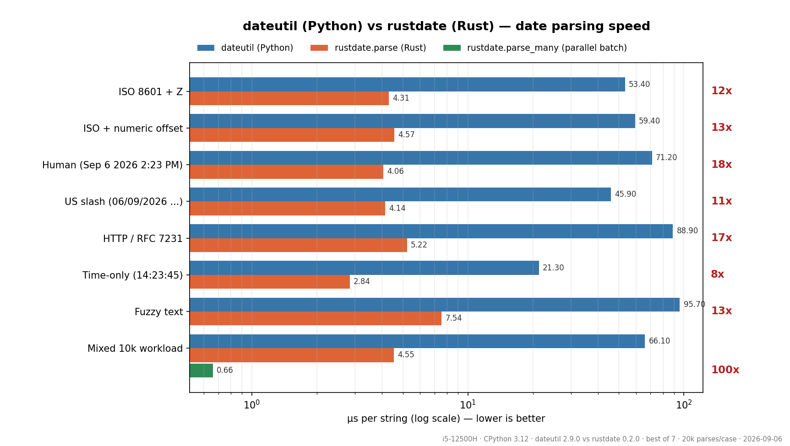

# rustdate ⚡

**A fast, dateutil-compatible date/time parser for Python, written in Rust** (PyO3).
Drop-in replacement for `dateutil.parser.parse` with the same kwargs, the same quirks,
a fraction of the time — plus features dateutil's parser doesn't have.

## Benchmarks — Python (dateutil) vs Rust (rustdate)

| Case | dateutil.parse | rustdate.parse | speedup |
|---|---:|---:|---:|
| ISO 8601 + `Z` (`2026-09-06T14:23:45Z`) | 53.4 µs | 4.31 µs | **12x** |
| ISO + numeric offset (`...+05:30`) | 59.4 µs | 4.57 µs | **13x** |
| Human (`Sep 6 2026 2:23 PM`) | 71.2 µs | 4.06 µs | **18x** |
| US slash (`06/09/2026 14:23:45`) | 45.9 µs | 4.14 µs | **11x** |
| HTTP / RFC 7231 (`Sun, 06 Sep 2026 ... GMT`) | 88.9 µs | 5.22 µs | **17x** |
| Time-only (`14:23:45`) | 21.3 µs | 2.84 µs | **8x** |
| Fuzzy text (`I met him on Sep 6 2026 ...`) | 95.7 µs | 7.54 µs | **13x** |
| **Mixed 10k workload** (5 hot formats) | **66.1 µs** | **4.55 µs** | **15x** |
| **Mixed 10k, parallel batch** (`parse_many`) | 66.1 µs | **0.66 µs** | **100x** |

<sub>Measured 2026-09-06 · i5-12500H · Windows 11 · CPython 3.12 · dateutil 2.9.0.post0 vs rustdate 0.2.0 ·
20,000 parses per case, best of 7 runs. Reproduce with `python bench.py`, plot with `python plot_bench.py`.</sub>



**Why the gap:** dateutil tokenizes with regexes and resolves the string through hundreds of
try/except format attempts in pure Python. rustdate hand-parses bytes in Rust with zero
allocations on the hot path, releases the GIL for batch parsing across all cores, and caches
timezone objects. Single-call numbers include ~2-3 µs of pyo3 kwargs-dispatch overhead —
hot loops should use `parse_many`, which amortizes it to ~0.66 µs/string (**100x faster
than dateutil, ~1.5M strings/sec on a laptop CPU**).

## Install / build

```bash
pip install maturin
maturin build --release          # -> target/wheels/rustdate-0.2.0-*.whl
pip install --force-reinstall --no-deps target/wheels/rustdate-*.whl
```

Or the quick local loop:

```bash
cargo build --release
cp target/release/rustdate.dll rustdate.pyd    # Windows; *.so on Linux/macOS
python bench.py                                 # parity checks + benchmark
python fuzz.py                                  # 5000-case differential fuzz
```

## Usage

```python
import rustdate

rustdate.parse("2026-09-06T14:23:45Z")
rustdate.parse("Sep 6 2026 2:23 PM")
rustdate.parse("06/09/2026", dayfirst=True)
rustdate.parse("10-11-12", yearfirst=True)
rustdate.parse("Sep 6", default=datetime(2020, 3, 15))       # missing fields from default
rustdate.parse("I met him on Sep 6 2026 at 2 PM", fuzzy=True)
rustdate.parse("2026-09-06 14:23:45 Asia/Kolkata")           # IANA zone, DST-aware
rustdate.parse_many(list_of_100k_strings, fuzzy=True)        # parallel batch
```

All failures raise `rustdate.ParserError` — a `ValueError` subclass, exactly like
`dateutil.parser.ParserError`, so existing `except ValueError` code keeps working.

## What's supported (verified against dateutil)

- **Formats**: ISO 8601 (`2026-09-06T14:23:45.123Z`), ISO week (`2026-W36-6`), ordinal
  (`2026-249`), compact (`20260906T143022`), slash/dash (`06/09/2026`, `12-25-2026`,
  `2026/09`, `9/6`), spaced (`2026 09 06`), human (`Sep 6, 2026`, `6 Sep 2026`,
  `Jan 99`, `Sep 6`), HTTP/email dates, time-only (`14:23:45`, `2:23 p.m.`)
- **Flags**: `dayfirst`, `yearfirst`, `fuzzy`, `default` — with dateutil's exact
  ymd backtracking (e.g. `"2026-09-06"` + `dayfirst` → Jun 9, `"03-27-01"` +
  `yearfirst` → 2001-03-27, `"15:09 AM"` time-only → error)
- **Jump words**: `at/on/of/and/ad`, ordinal suffixes (`6th`), `p.m.` — ignored even
  without `fuzzy`, like dateutil
- **Timezones**: `Z/GMT/UTC/UT` (aware); `EST/PST/IST...` recognized-but-dropped →
  naive, identical to dateutil without `tzinfos`; anything else resolves through
  `zoneinfo` — IANA names and `EST5EDT`-style zones are DST-aware
- **Missing components** are copied from `default` (default: today at midnight)

## Where rustdate is *more* capable than dateutil's parser

- ISO week and ordinal dates (`dateutil.isoparse` handles them, `dateutil.parse` doesn't)
- IANA zone names (`"Asia/Kolkata"`, `"America/New_York"`) and `"EST5EDT"` — dateutil's
  parser raises `ParserError` on these (its `gettz` works only standalone)
- Heavy fuzzy debris (`"updated: 2024-08-17 15:09 ok"` with orphan punctuation)

## Correctness methodology

- 11 Rust unit tests
- 72-case parity suite vs dateutil ([bench.py](bench.py)) — all pass
- 5000-case seeded differential fuzz ([fuzz.py](fuzz.py)) — **0 mismatches**:
  4774 identical outputs, 173 identical rejections, 53 cases where only rustdate parses

## Known divergences (deliberate)

- Time-only strings resolve to *today* — non-deterministic by design (dateutil does the same)
- `tzinfos=`-style custom abbreviation mapping is not implemented (pass IANA names instead)
- Single-call speed includes pyo3 kwargs-dispatch overhead; `parse_many` amortizes it
